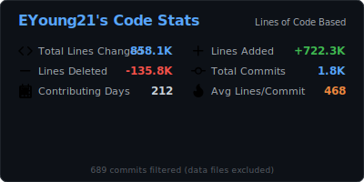

# True GitHub Commit Graph

> **Measure your GitHub contributions by Lines of Code, not just commit count.**


<p align="center">
  
</p>

<p align="center">
  
</p>

## Why?

GitHub's contribution graph counts commits, which doesn't reflect actual work:
- One commit could be 2 lines
- Another could be 2,000 lines  
- Data file uploads inflate the graph

**True GitHub Commit Graph** generates a contribution heatmap based on actual lines of code changed, with intelligent filtering to exclude:
- Data files (JSON, CSV, etc.)
- Generated/minified code
- Package lock files
- Large bulk uploads (configurable threshold)

---

## 🚀 Quick Start - Add to Your Profile

### Option 1: Deploy Your Own (Recommended)

#### Step 1: Fork & Deploy to Vercel

1. Fork this repo
2. Go to [vercel.com](https://vercel.com) and import your fork
3. Add environment variable:
   - `GITHUB_TOKEN` = Your GitHub Personal Access Token ([create one here](https://github.com/settings/tokens) with `repo` scope)
4. Deploy!

#### Step 2: Add to Your README

**Option A: Recent Commits (Recommended - Shows last 50 commits)**
```html
<!-- True GitHub Commit Graph - Recent Commits -->
<p align="center">
  
</p>

<p align="center">
  
</p>
```

**Option B: Yearly Graph (Full year calendar)**
```html
<!-- True GitHub Commit Graph - Yearly -->
<p align="center">
  
</p>

<p align="center">
  
</p>
```

---

### Option 2: GitHub Actions (Auto-Update)

This generates static SVGs and commits them to your repo.

#### Step 1: Setup

1. Fork/clone this repo
2. Go to repo **Settings → Secrets and variables → Actions**
3. Click **"New repository secret"**
4. Name: `GH_PAT`
5. Value: Your GitHub Personal Access Token ([create one here](https://github.com/settings/tokens) with `repo` scope)
6. Click **"Add secret"**

#### Step 2: The Action runs automatically!

The workflow updates your graphs every 6 hours. Then add to your README:

```html
<p align="center">
  
</p>
```

---

## 📋 Example for Your Profile

Here's how to integrate it with your existing GitHub profile (matching your style):

```html
## 📊 GitHub Analytics

<p align="center">
  
  
</p>

## 📈 True Contribution Graph
> **Lines of Code based** - A more accurate picture of contributions

**Recent Commits (Last 50):**
<p align="center">
  
</p>

<p align="center">
  
</p>

**Or Yearly Graph:**
<p align="center">
  
</p>
```

---

## 🎨 Available Themes

Use `?theme=THEME_NAME` in your URL:

| Theme | Description |
|-------|-------------|
| `github_dark` | Default dark theme (matches your current style) |
| `github` | Light theme |
| `dracula` | Popular dark theme |
| `nord_dark` | Nordic inspired |
| `tokyo_night` | Cyberpunk aesthetic |
| `radical` | Hot pink vibes |
| `monokai` | Classic editor theme |
| `gruvbox` | Retro groove |
| `synthwave` | 80s retrowave |
| `catppuccin` | Soothing pastel |

---

## ⚙️ API Endpoints

### Recent Commits (Recommended)
- `/api/graph-recent` - Shows last X commits in a 90-day calendar view
- `/api/stats-recent` - Stats for last X commits

### Yearly Graph
- `/api/graph` - Full year calendar (last 365 days)
- `/api/stats` - Stats for the full year

## ⚙️ API Parameters

| Parameter | Description | Default |
|-----------|-------------|---------|
| `username` | GitHub username (required) | - |
| `theme` | Color theme | `github_dark` |
| `hide_border` | Hide card border | `false` |
| `limit` | Number of commits to fetch (recent endpoints only) | `50` |
| `max_lines_per_file` | Filter threshold for data dumps | `2000` |

**Examples:**
```
/api/graph-recent?username=EYoung21&theme=github_dark&hide_border=true&limit=50
/api/graph?username=EYoung21&theme=dracula&hide_border=true
```

---

## 🔧 Filter Configuration

The graph automatically excludes:

### File Extensions
`json`, `csv`, `xml`, `yaml`, `sql`, `lock`, `min.js`, `min.css`, `bundle.js`, `svg`, `png`, `jpg`, `gif`, `pdf`, `woff`, `ttf`

### Paths
`node_modules/`, `vendor/`, `dist/`, `build/`, `__pycache__/`, `.venv/`

### Large Files
Any single file with more than 2000 lines added (configurable)

---

## 🛠️ Local Development

```bash
# Clone
git clone https://github.com/EYoung21/true_github_commit_graph.git
cd true_github_commit_graph

# Install
npm install

# Configure
cp env.example .env
# Edit .env with your GITHUB_TOKEN and GITHUB_USERNAME

# Generate
npm run generate

# Cards appear in ./output/
```

---

## 📊 How It Works

1. **Fetches your repositories** via GitHub GraphQL API
2. **Gets commit details** with file-level stats via REST API
3. **Filters out noise** - data files, generated code, bulk uploads
4. **Aggregates by date** into a contribution calendar
5. **Generates beautiful SVGs** with D3.js

---

## 📄 License

MIT

---

*Inspired by [github-profile-summary-cards](https://github.com/vn7n24fzkq/github-profile-summary-cards) and [github-readme-stats](https://github.com/anuraghazra/github-readme-stats)*

